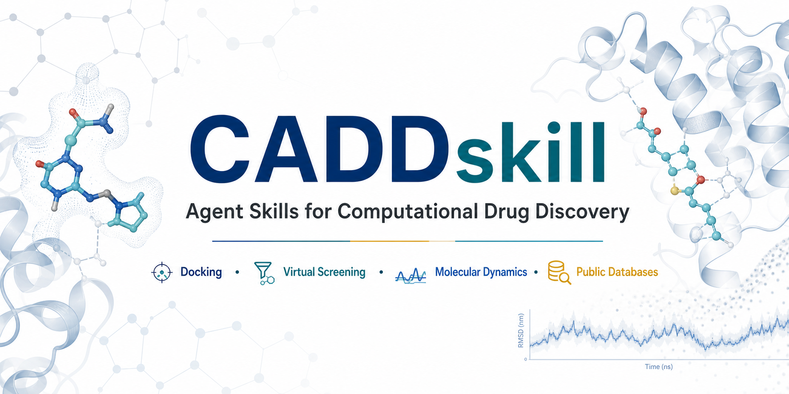

<p align="center">
  
</p>

# CADD Skill Collection

English version: [README.md](README.md)

这个仓库提供可复用的 Codex/Claude 风格 skill，面向 CADD/AIDD 工作流，适合分子对接、虚拟筛选、分子动力学、增强采样、蛋白设计、AlphaFold3 结果分析，以及公开化学/生物数据库查询。

Skill 不是完整软件安装器，而是面向 Agent 的工作流说明，必要时附带辅助脚本、模板和参考文档。支持 skill 的 Agent 应先读取对应 `SKILL.md`，检查用户真实输入文件和本地环境，再适配路径、软件和计算资源，最后可复现地执行或打包工作流。

## 包含内容

| 方向 | Skills |
| --- | --- |
| 分子动力学 | `amber-md-expert`、`gmx-workflow-packer` |
| 分子对接 | `hdock`、`haddock`、`unidock-pro` |
| 蛋白设计与 AF3 分析 | `rfdiffusion3`、`af-analysis` |
| 化合物与活性数据库 | `pubchem-pug-skill`、`chembl-skill`、`bindingdb-skill`、`chebi-skill` |
| 蛋白与结构数据库 | `uniprot-skill`、`rcsb-pdb-skill` |

## 快速选择

当你知道任务类型，但不确定该用哪个 skill 时，先看这张表。

| 任务 | Skill | 适合场景 | 典型输出 |
| --- | --- | --- | --- |
| Amber MD 准备或分析 | `amber-md-expert` | Amber/AmberTools、拓扑准备、cpptraj、MM/GBSA、PBSA、续跑检查 | MD 运行目录、分析脚本、图片、总结说明 |
| GROMACS 常规 MD | `gmx-workflow-packer` | EM、NVT、NPT、production MD、GROMACS 运行打包 | 常规 MD bundle，含 `mdp/`、`run.sh`、`state.yaml`、分析说明 |
| GROMACS tREMD/REST2 | `gmx-workflow-packer` | tREMD、REST2/HREX、PLUMED partial tempering、demux、交换效率分析 | replica 运行包、HREX 预检结果、后处理脚本 |
| 本地 HDOCK 对接 | `hdock` | 蛋白-蛋白或蛋白-核酸 HDOCKlite case | `hdock.out`、复合物模型、日志、运行摘要 |
| HADDOCK 对接 | `haddock` | active/passive residues、AIR restraints、信息驱动对接 | HADDOCK 项目、约束文件、cluster summary、模型排名 |
| GPU 虚拟筛选 | `unidock-pro` | UniDock-Pro classical docking、similarity search、hybrid docking | ligand index、对接输出、排序 CSV、搜索框和模式说明 |
| RFdiffusion3 设计 | `rfdiffusion3` | Foundry/RFD3 binder、核酸 binder、小分子 binder、enzyme scaffold | RFD3 输入、smoke test 说明、设计输出、QC/后处理模板 |
| AlphaFold3 结果分析 | `af-analysis` | AF3 Server `fold_*.zip`、本地 AF3 输出、PAE/界面指标 | 排名表、CSV/Markdown summary、PAE 图、界面指标 |
| PubChem 查询 | `pubchem-pug-skill` | 化合物性质、描述、assay summary、substance | 精简 PubChem 摘要，或按需保存 raw payload |
| ChEMBL 查询 | `chembl-skill` | activity、molecule、target、mechanism、文本搜索 | 精简活性或靶点摘要 |
| BindingDB 查询 | `bindingdb-skill` | 按 PDB、UniProt 或相似性查询靶点-配体结合记录 | 精简结合证据摘要 |
| RCSB PDB 查询 | `rcsb-pdb-skill` | PDB metadata、结构搜索、FASTA 下载 | 结构 metadata、链和来源总结 |
| UniProt 查询 | `uniprot-skill` | UniProtKB、UniRef、UniParc、FASTA、注释 | 蛋白身份、序列、功能注释摘要 |
| ChEBI 查询 | `chebi-skill` | 化学身份、ontology、结构 metadata | 精简 ChEBI 化合物/ontology 摘要 |

## 仓库结构

```text
skills/
  af-analysis/
  amber-md-expert/
  bindingdb-skill/
  chebi-skill/
  chembl-skill/
  gmx-workflow-packer/
  haddock/
  hdock/
  pubchem-pug-skill/
  rcsb-pdb-skill/
  rfdiffusion3/
  unidock-pro/
  uniprot-skill/
```

每个 skill 都有必需的 `SKILL.md`，并可能带有 `scripts/`、`references/`、`assets/` 或 `agents/`。

- `SKILL.md`：触发条件和核心工作流。
- `scripts/`：重复任务的确定性辅助脚本。
- `references/`：更长的方法说明，只在需要时读取。
- `assets/`：用于生成输出的模板或资源。
- `agents/openai.yaml`：可选的 Agent UI 元数据。

## 安装和更新

克隆仓库：

```bash
mkdir -p ~/repos
cd ~/repos
git clone https://github.com/makabaka007x/cadd-skill.git
cd cadd-skill
```

后续更新：

```bash
cd ~/repos/cadd-skill
git pull --ff-only
```

安装所有 skill 到 Codex skill root：

```bash
mkdir -p ~/.codex/skills
for skill_dir in skills/*; do
  [ -f "$skill_dir/SKILL.md" ] && rsync -a "$skill_dir" ~/.codex/skills/
done
```

只安装单个 skill：

```bash
mkdir -p ~/.codex/skills
rsync -a skills/gmx-workflow-packer ~/.codex/skills/
```

如果使用 Claude 风格的本地 skill root，把同样目录复制到当前启用的 Claude skill 目录：

```bash
mkdir -p ~/.claude/skills
rsync -a skills/unidock-pro ~/.claude/skills/
```

检查 skill 列表：

```bash
find skills -maxdepth 2 -name SKILL.md | sort
```

如果本地有 skill validator：

```bash
python3 ~/.codex/skills/.system/skill-creator/scripts/quick_validate.py ~/.codex/skills/gmx-workflow-packer
```

## Skill 详细说明

### `amber-md-expert`

`amber-md-expert` 用于把 Amber 和 AmberTools 任务整理成可复现的准备、运行、续跑或分析目录。

适合：

- `pdb4amber`、`tleap`、`antechamber`、`parmchk2`、`pmemd`、`pmemd.cuda`、`cpptraj`、`MMPBSA.py` 或 PBSA。
- 显式溶剂、隐式溶剂、膜体系、核酸、Zn、非标准残基和 REMD。
- 扩展 Amber 任务前检查 restart 链。
- 基础轨迹处理、contact 分析、DSSP/DSSPplot 和 MM/GBSA 类分析包。

常见输入：

- 原始 PDB、蛋白-配体复合物、配体文件，或已有 Amber `prmtop`/`inpcrd`/`rst7`。
- 力场、水模型、离子条件、生产模拟时长和目标机器限制。

典型输出：

- 准备好的运行目录、输入文件、提交脚本模板、`UPLOAD_AND_RUN.md` 和续跑说明。
- 可选分析包，包括 `cpptraj` 脚本、去水轨迹、代表帧、表格和图片。

注意：

- 力场、质子化状态、水模型、离子放置和生产时长都是科学决策。
- 集群 partition、QOS、module、account 和 wall-time 必须按目标机器修改。

### `gmx-workflow-packer`

`gmx-workflow-packer` 用于打包 GROMACS 常规 MD、tREMD 和 REST2/HREX 工作流。

适合：

- 常规 MD：EM、限制平衡、NVT、NPT、production、续跑和基础分析。
- tREMD：温度梯度、副本目录、分段续跑、demux、交换效率和轨迹重排。
- REST2/HREX：PLUMED `partial_tempering`、hot region 拓扑准备和 `-hrex` 能力检查。

常见输入：

- 已准备好的 GROMACS `topol.top` 和 `1EM.gro` 等坐标文件。
- 或蛋白 PDB，用于生成 `pdb2gmx -> editconf -> solvate -> genion -> EM` 准备脚本。
- 蛋白配体体系还需要配体文件和 ACPYPE/GAFF 等参数化方案。

典型输出：

- 常规 MD bundle：`mdp/`、`run.sh`、`state.yaml`、`UPLOAD_AND_RUN.md` 和分析说明。
- tREMD bundle：`step1/`、`step2/`、`run.sh`、温度梯度文件、demux 工具和交换分析。
- REST2 预检包：如果目标 GROMACS/PLUMED 模块没有 `-hrex`，会阻断生产脚本。

注意：

- `sampling.mode=md` 使用 `assets/md-config-template.yaml` 和 `scripts/build_md_bundle.py`。
- `sampling.mode=tremd` 和 `sampling.mode=rest2` 使用增强采样模板。
- REST2 effective temperature 不是 thermostat 真实温度，而是 Hamiltonian 缩放带来的有效温度。

### `hdock`

`hdock` 用于运行和打包本地 HDOCKlite 对接 case。

适合：

- 蛋白-蛋白对接。
- 蛋白-核酸对接。
- 带 `rsite.txt`、`lsite.txt` 或 `restr.txt` 的 HDOCK 任务。
- 从已有 `hdock.out` 导出复合物模型。

典型输出：

- `hdock.out`
- `models.pdb`
- 复制后的输入文件
- stdout/stderr 日志
- `run-summary.json`

注意：

- HDOCK score 是对接优先级证据，不是生物学验证。
- 约束只应在用户提供或科学上合理时使用。

### `haddock`

`haddock` 用于创建、运行和分析 HADDOCK 2.5 项目。

适合：

- 蛋白-蛋白、蛋白-DNA/RNA、蛋白-配体、多肽和约束驱动对接。
- active/passive residues、AIR restraints、ambiguous interaction restraints 或 HADDOCK examples。
- cluster scoring、top model 选择和结果总结。

典型输出：

- HADDOCK 项目目录
- 参数和约束文件
- cluster score table
- 筛选出的 top models
- 与约束和打分相匹配的解释说明

注意：

- HADDOCK 依赖已经配置好的本地或授权环境。
- Skill 中的路径是占位符，用户必须改成自己的安装路径。

### `unidock-pro`

`unidock-pro` 用于运行 UniDock-Pro GPU 虚拟筛选。

适合：

- 使用 `receptor.pdbqt` 和配体库做 classical docking。
- 使用 reference ligand 做 ligand similarity searching。
- 同时使用 receptor 和 reference ligand 做 hybrid docking。
- 把 `*_out.pdbqt` 汇总成排序 CSV。

常见输入：

- receptor PDBQT
- ligand directory 或 ligand index
- similarity/hybrid 模式需要 reference ligand
- search-box center 和 size
- 明确的 `search_mode`

典型输出：

- ligand index
- UniDock-Pro 输出 PDBQT
- 日志
- 排序 CSV
- 实际模式、搜索框和关键假设说明

注意：

- `search_mode` 必须显式确认。
- 每次筛选用新的输出目录，避免混合不同任务结果。
- hybrid docking 默认 reference ligand 与受体结合位点兼容。

### `rfdiffusion3`

`rfdiffusion3` 用于验证和运行 RosettaCommons Foundry/RFdiffusion3 工作流。

适合：

- RFD3 环境验证。
- checkpoint 检查。
- 官方 demo smoke test。
- protein binder、nucleic-acid binder、small-molecule binder、enzyme scaffold 或 partial-diffusion design。
- 可选 ProteinMPNN/LigandMPNN/RF3 类后处理。

典型输出：

- 环境验证说明
- 设计输入 JSON/YAML
- RFD3 运行目录
- 可选 MPNN/RF3 后处理脚本
- 基础 QC summary

注意：

- 写设计输入前必须检查 chain ID、残基编号、ligand residue name 和输入路径。
- 昂贵 GPU 任务前先跑小规模、低显存 smoke test。

### `af-analysis`

`af-analysis` 使用 `af-analysis` Python 包分析 AlphaFold3 预测结果。

适合：

- AlphaFold Server `fold_*.zip`。
- 本地 AF3 输出目录，包含 `.cif`/`.pdb` 和 JSON。
- ipTM、ipTM_d0、pDockQ、mpDockQ、LIS、PAE 和界面质量比较。

典型输出：

- Markdown 排名表
- CSV 排名表
- PAE heatmap
- summary text
- 界面置信度说明

注意：

- AF3 置信度指标只能用于优先级排序，不能直接当作实验证据。
- NGLView 3D 可视化需要兼容的 Jupyter 环境。

### 数据库 Skills

数据库 skill 是轻量 REST/API helper。默认返回精简摘要，除非用户明确要求，否则不保存大体积 raw payload。

| Skill | 主要用途 | 常见查询 |
| --- | --- | --- |
| `pubchem-pug-skill` | PubChem 化合物性质、描述、assay、substance | CID/name lookup、分子式、分子量、assay summary |
| `chembl-skill` | ChEMBL activity、molecule、target、mechanism、文本搜索 | ligand activity table、target metadata、mechanism records |
| `bindingdb-skill` | BindingDB 靶点-配体证据 | 某个 UniProt 靶点的已知配体、PDB 关联靶点的结合数据 |
| `rcsb-pdb-skill` | RCSB PDB metadata、结构搜索、FASTA | 结构可用性、chain ID、来源物种、实验方法 |
| `uniprot-skill` | UniProt 蛋白身份、序列、注释 | accession lookup、FASTA、domain/function annotations |
| `chebi-skill` | ChEBI 化合物身份和 ontology | synonyms、ontology parents/children、chemical metadata |

## 联合调用示例

下面是给支持 skill 的 Agent 的 prompt，不是 shell 命令。

### 从公开证据到虚拟筛选

目标：建立靶点相关配体集合，完成对接，并给 ranked hits 加注释。

1. 确认靶点。
2. 找结构和结合位点证据。
3. 收集已知配体和活性记录。
4. 建立或检查 ligand library。
5. 运行 UniDock-Pro。
6. 注释并总结 ranked hits。

Prompt：

```text
Use $uniprot-skill and $rcsb-pdb-skill to confirm the target identity, available structures, chain IDs, organism, mutations, and co-crystal ligands. Then use $chembl-skill, $bindingdb-skill, and $pubchem-pug-skill to collect known ligands and activity evidence. Build a clean ligand library, run $unidock-pro classical docking against the prepared receptor, and return a ranked CSV with the search-box, search_mode, ligand provenance, and top-hit annotation.
```

后续注释：

```text
Use $bindingdb-skill and $chembl-skill to annotate the top 50 UniDock-Pro hits with known target or analog evidence. Group hits into known actives, analog-supported candidates, and apparently novel candidates. Keep docking scores separate from experimental binding evidence.
```

### 结构指导的分子对接

目标：根据体系类型和约束信息选择正确的对接路线。

Prompt：

```text
Use $uniprot-skill to confirm the protein sequence, isoform, domain boundaries, mutations, and residue numbering. Use $rcsb-pdb-skill to identify suitable template structures and chain IDs. If the task is protein-protein or protein-nucleic-acid docking without detailed restraints, use $hdock and export the top models. If active/passive residues, AIR restraints, or experimental interaction evidence are available, prepare a $haddock project and rank the resulting clusters.
```

配体身份核对：

```text
Use $pubchem-pug-skill and $chebi-skill to confirm ligand identity, synonyms, structure identifiers, and charge-relevant metadata before preparing ligand docking files.
```

### 对接后分子动力学

目标：把筛选出的 docking model 变成可复现 MD 运行包。

Amber 路线：

```text
Use $rcsb-pdb-skill and $uniprot-skill to verify the source structure, chain IDs, mutations, missing residues, and sequence coverage. Then use $amber-md-expert to prepare an explicit-solvent Amber MD package for the selected docking model, including topology preparation, staged minimization/equilibration, restart checks, and basic cpptraj analysis.
```

GROMACS 常规 MD 路线：

```text
Use $gmx-workflow-packer to build a conventional GROMACS MD bundle from this prepared topol.top and 1EM.gro. Generate EM/NVT/NPT/production MDP files, a resumable run.sh, state.yaml, UPLOAD_AND_RUN.md, and basic analysis notes. Keep all cluster partition, QOS, module, and wall-time values as target-machine placeholders until confirmed.
```

增强采样路线：

```text
Use $gmx-workflow-packer to prepare a tREMD bundle for this GROMACS system. Estimate or validate the temperature ladder, create step1/step2/run.sh, include demux and exchange-efficiency analysis scripts, and explain how to resume segmented production. If I ask for REST2, first check whether the target GROMACS/PLUMED module supports both -plumed and -hrex.
```

### AF3 结果到 MD 或设计

目标：先给预测复合物排序，再决定哪些结构值得模拟或设计跟进。

Prompt：

```text
Use $af-analysis to rank these AlphaFold3 fold_*.zip files by ipTM_d0, pDockQ, mpDockQ, LIS, and PAE. For the best-supported interfaces, recommend whether to prepare an $amber-md-expert MD package, a $gmx-workflow-packer MD package, or an $rfdiffusion3 design follow-up. Keep all conclusions limited to prediction confidence until simulation or experimental evidence exists.
```

### 带证据检查的蛋白设计

目标：用干净的靶标结构和残基信息准备 RFD3 设计任务。

Prompt：

```text
Use $uniprot-skill and $rcsb-pdb-skill to confirm target identity, chain IDs, residue numbering, missing regions, and ligand or nucleic-acid components. Then use $rfdiffusion3 to validate the Foundry/RFD3 environment, run a small smoke test, inspect the input structure, and prepare a first-pass binder design job with conservative low-memory settings.
```

## 参考资料和上游链接

下面这些链接用于查看方法文档、安装说明、API 行为和 citation 建议。写论文时，应优先引用各上游项目推荐的原始方法论文。

### 分子动力学和增强采样

| 主题 | 参考资料 |
| --- | --- |
| Amber / AmberTools | [Amber 官方网站](https://ambermd.org/)、[Amber manuals](https://ambermd.org/Manuals.php)、[Amber tutorials](https://ambermd.org/tutorials/)、[Amber force fields](https://ambermd.org/AmberModels.php) |
| GROMACS | [GROMACS documentation](https://manual.gromacs.org/current/index.html)、[installation guide](https://manual.gromacs.org/current/install-guide/index.html)、[mdrun features](https://manual.gromacs.org/current/user-guide/mdrun-features.html)、[replica exchange](https://manual.gromacs.org/current/reference-manual/algorithms/replica-exchange.html) |
| PLUMED / REST2 相关 | [PLUMED user manual](https://www.plumed.org/doc-v2.9/user-doc/html/)、[PLUMED tutorials](https://www.plumed.org/doc-v2.9/user-doc/html/tutorials.html) |

### 对接、筛选、设计和 AF3 分析

| 主题 | 参考资料 |
| --- | --- |
| HDOCK | [HDOCK server](https://hdock.phys.hust.edu.cn/)、[HDOCK help](https://hdock.phys.hust.edu.cn/help.php) |
| HADDOCK | [HADDOCK 2.4/2.5 software page](https://www.bonvinlab.org/software/haddock2.4/)、[HADDOCK documentation](https://www.bonvinlab.org/software/haddock2.4/documentation/) |
| Uni-Dock / UniDock-Pro 相关 | [Uni-Dock GitHub](https://github.com/dptech-corp/Uni-Dock)、[Uni-Dock JCTC paper DOI](https://doi.org/10.1021/acs.jctc.2c01145) |
| RFdiffusion3 / Foundry | [Foundry GitHub](https://github.com/RosettaCommons/foundry)、[RFdiffusion3 documentation](https://rosettacommons.github.io/foundry/models/rfd3/index.html)、[RFD3 input specification](https://rosettacommons.github.io/foundry/models/rfd3/input.html) |
| AlphaFold3 结果分析 | [af_analysis GitHub](https://github.com/samuelmurail/af_analysis)、[af_analysis documentation](https://af-analysis.readthedocs.io/) |

### 公共数据库和 API

| 数据库 | 参考资料 |
| --- | --- |
| PubChem | [PubChem PUG REST](https://pubchem.ncbi.nlm.nih.gov/docs/pug-rest)、[PubChem docs](https://pubchem.ncbi.nlm.nih.gov/docs) |
| ChEMBL | [ChEMBL REST API](https://www.ebi.ac.uk/chembl/api/data/docs)、[ChEMBL web services](https://chembl.gitbook.io/chembl-interface-documentation/web-services) |
| BindingDB | [BindingDB home](https://www.bindingdb.org/)、[BindingDB web services/downloads](https://www.bindingdb.org/rwd/bind/chemsearch/marvin/SDFdownload.jsp?all_download=yes) |
| RCSB PDB | [RCSB Data API](https://data.rcsb.org/)、[RCSB Search API](https://search.rcsb.org/)、[RCSB PDB](https://www.rcsb.org/) |
| UniProt | [UniProt API help](https://www.uniprot.org/help/api)、[UniProt REST API endpoint](https://rest.uniprot.org/) |
| ChEBI | [ChEBI API documentation](https://www.ebi.ac.uk/chebi/backend/api/docs/)、[ChEBI search](https://www.ebi.ac.uk/chebi/) |

## 本地配置检查清单

运行昂贵任务前，先确认：

- 输入路径真实存在，不是过期中间文件。
- protein chain ID、残基编号、ligand residue name 和质子化假设清楚。
- 力场、水模型、离子条件和约束选择有科学依据。
- GPU/CPU partition、QOS、account、module、MPI launcher 和 wall-time 限制与目标机器一致。
- 输出目录是新的，或者覆盖行为已经明确允许。
- 全量 production 前已经通过小规模 smoke test 或短跑。

## 公开使用和安全说明

- 把 `/path/to/...`、`<cpu-partition>`、`<gpu-qos>` 这类占位路径改成目标机器真实配置。
- 数据库 skill 默认返回精简摘要；只有用户明确要求时才保存 raw API payload。
- 不要提交私人 home 目录、WSL mount 路径、集群账号、token、API key、密码、私钥、未公开课题数据或个人机器路径。
- docking score、AF3 置信度指标和设计输出要与实验数据分开表述。
- 昂贵的 docking、MD、筛选或蛋白设计任务前，先跑小规模验证或 smoke test。
- 最终输出要记录关键假设：输入来源、已知软件版本、search box、力场、模拟时长，以及尚未验证的生物学解释。
